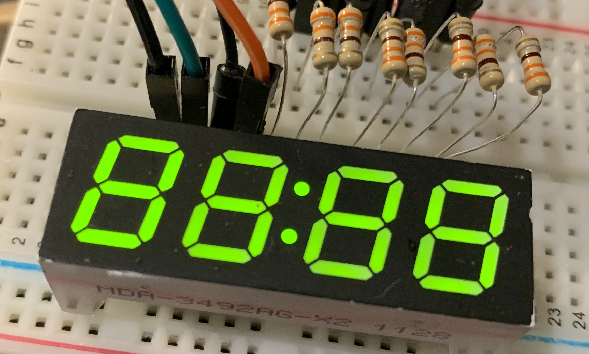

# NSegmentDisplay
Arduino library for programming non-standard multiplexed LED displays, such as those from appliances. 
Standard 7-segment displays can be wired with drivers and programmed with many libraries that provide ease of use. But non-standard LED displays don't have such convenience because of their variability. With this library I am trying to provide some shortcuts to programming any LED appliance display provided it is multiplexed, that is, its circuit has shared common pins to address specific digits with individual pins for segments across digits. 
## Where to get them
Non-standard LED displays can be found in common discarded appliances such as microwaves and DVD/VCR players. <a href="https://metatek.blogspot.com/2020/06/hacking-non-standard-7-segment-displays.html" target="_blank">See this tutorial</a> for tips on removing them from such devices and making a game with it.
## Usage
<b>Include the library</b> 
<code>
  #include <NSegmentDisplay.h>
  </code>
   
  <b>Create the display instance</b> 
Because displays vary in their number of multiplexed digits and segments in each digit this data is passed to the instance through digit and segment pin arrays. Before creating these arrays use a 3V power source to probe pairs of pins to determine the following, (constructing a pinout diagram will help): 
  <ul>
    <li>Which pins control each digit, and which pins control the segments.</li>
    <li>Is the display common anode or common cathode? Most are common anode, so the digit pins have positive voltage and segments are ground.</li>
  </ul>
Now create the digit and segment data that will be passed to the object instance, as in this example: 
   
  This dislay is only slightly non-standard because of the additional segment for the colon. It happens to be common cathode.
  <pre>
    int NUM_SEG_PINS = 8;
    int NUM_DIGIT_PINS = 4;
    int segments[] = {10, 11, 12, 6, 7, 8, 13, 9};
    int digits[] = {3, 5, 4, 2};
    NSegmentDisplay disp(false, NUM_SEG_PINS, segments, NUM_DIGIT_PINS, digits);
  </pre>
   
  In the above, variables are declared for the number of segment and digit pins, and the pin sequence for the segments and digit arrays are constructed as follows: 
  1) If numbers are possible and desired, sequence the segment pins in order for the first 7 pins to display the 7 conventional segments for a number digit, that is: 
  &nbsp;&nbsp;A 
  F&nbsp;B 
  &nbsp;G 
  E&nbsp;C 
  &nbsp;D 
  This will allow you to use a convenient number function that assumes pins arranged in that order. 
  2) Order digit pins from right to left. 
  The first argument in the display instance is true for common anode and false for common cathode.
